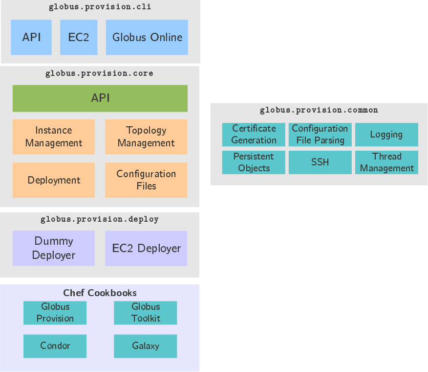

.. _chap_developer:

Developer Documentation
***********************

This chapter provides details on how Globus Provision is implemented, and how it can be extended.
Besides providing an overview of its internal architecture, this chapter focuses mostly on how 
to add support for additional software (i.e., how to "tell" Globus Provision how to install
and configure a new piece of software).

Globus Provision Architecture
=============================

Globus Provision is implemented in Python and is organized into four main components:

* :ref:`sec_dev_core`: Manages instances, but delegates infrastructure-specific actions
  (like requesting an EC2 instance) to pluggable "deployers". The core provides an API
  that is used by the Command-Line Interface, and could potentially be used by other
  frontends.
* :ref:`sec_dev_deploy`: Pluggable modules that handle infrastructure-specific actions. 
* :ref:`sec_dev_cli`: A console frontend to Globus Provision that allows a user
  to request instances, start them, etc.
* :ref:`sec_dev_common`: Miscellaneous packages that provide functionality needed
  throughout Globus Provision, like certificate generation, thread management, etc.

To configure hosts in a topology, Globus Provision relies on `Chef <http://www.opscode.com/chef/>`_,
a configuration management framework. In Chef, the actions required to set up a specific
piece of software are specified in a Ruby script called a *recipe*. Similar recipes are
usually grouped into a *cookbook*. Globus Provision includes several :ref:`sec_dev_chef` that
handle basic host setup (like creating users, installing a host certificate, etc.) and 
installation and configuration of Globus and other software. 

Each of the above components is described in more detail below. Additionally, no developer 
documentation is complete without the obligatory layered diagram, so here is
a summary of Globus Provision's architecture:

.. _sec_dev_core:

Core
----

This is the heart of Globus Provision. The core is in charge of managing
instances (creating, starting, stopping, etc.). Although the core orchestrates
the deployment of instances, it does not have any infrastructure-specific code.
In other words, the core knows how to start an instance but, when it reaches a point
where an infrastructure-specific action has to be taken (e.g., "start an EC2 instance"),
it delegates that task to the appropriate :ref:`deployer <sec_dev_deploy>`.

The core exposes an API to create and manage instances. The commands in the 
:ref:`sec_dev_cli` only interact with the core through that API. This API
is currently meant to be used locally (i.e., not accessible through a network
via a remote call interface like REST, SOAP, etc.) and by a single user (i.e., there 
is no notion of different users owning different instances). Future versions of 
Globus Provision may run as a daemon with a remotely-accessible API that supports 
multiple users.

.. _sec_dev_deploy:

Deployers
---------

Globus Provision can support multiple deployment backends, selected on a per-instance basis.
Currently, Amazon EC2 is the only "real" deployer available. A "dummy" deployer is also
available for testing purposes. However, additional deployers can be implemented by
creating a child class of ``globus.provision.core.deploy.BaseDeployer``.

.. _sec_dev_cli:

Command-Line Interface
----------------------

The Command-Line Interface (CLI) is currently the only frontend to the API. It provides
all the commands listed in :ref:`chap_cli_ref`. The commands are actually divided into
three groups:

* *API*: These are commands that map to an API function (e.g., :ref:`cli_gp-instance-start`
  is a wrapper for the ``instance_start`` API function). The majority of commands
  fall into this category.
* *Globus Online*: Currently only includes :ref:`cli_gp-go-register-endpoints`. This
  command doesn't correspond to any Globus Provision API function, since creating
  a Globus Online endpoint is done through the Globus Online Transfer API.
* *EC2*: Includes commands to create and update :ref:`Globus Provision AMIs <sec_ami>`.

.. _sec_dev_common:

Common Package
--------------

Any code that provides a supporting functionality is placed in this package. For example,
this package includes modules for generating X.509 certificates, managing deployment threads,
the persistent object library that is used to define topologies in the core, etc.

.. _sec_dev_chef:

Chef Cookbooks
--------------

Globus Provision includes several Chef cookbooks that take care of installing and setting up
software in a Globus Provision instance. Although these cookbooks are included
with Globus Provision, they are not actually used when running any of the Globus Provision
commands. Instead, the Chef files are pre-deployed on the Globus Provision AMI
(in the ``/chef`` directory). When a Globus Provision instance is deployed, Globus Provision
will SSH into each host, and will run Chef, instructing it to run only the recipes
that are required on that host.

By keeping the installation/configuration code separate, it is relatively easy to
add support for a new piece of software (i.e., one that we do not currently provide a recipe for) 
without having to modify a single line of Globus Provision's core. This process is described 
in the following section.

Writing and Adding Chef Recipes
===============================

Since the installation and configuration of software on a Globus Provision instance is
handled by Chef, you will need to be familiar with Chef to add a new recipe to Globus
Provision. An explanation of how to get started with Chef is beyond the scope of this
documentation. Although the Chef project does provide 
`abundant documentation <http://wiki.opscode.com/display/chef/Home>`_,
it can be hard to navigate: Chef is a large and complex piece of software, and Globus
Provision doesn't use some of the more complex features described in their documentation.
We suggest that you focus on the following resources:

* `Recipes <http://wiki.opscode.com/display/chef/Recipes>`_. This page provides a good
  introduction to the anatomy of a Chef recipe. As you read through this page,
  take into account that Globus Provision uses the 
  `chef-solo <http://wiki.opscode.com/display/chef/The+Different+Flavors+of+Chef>`_
  tool, and not the
  Chef server/client architecture (i.e., you can safely skip the portions that refer
  to their server/client tools, which are much more elaborate than ``chef-solo``).
* `Resources <http://wiki.opscode.com/display/chef/Resources>`_. In Chef lingo, a recipe
  manages *resources* on a host. The term "resource" is used in a very broad sense: it
  can refer to a configuration file, a package, a user, etc. Thus, the bulk of a
  Chef recipe is a list of resources. 
  
  To give you an idea, the Globus Provision recipe
  for a domain's NFS server must specify that an NFS server package must be installed,
  and that the directories for the NFS shares must be created. Those resources look like this::
  
    package "nfs-kernel-server" do
      action :install
    end
	
    directory "/nfs/home" do
      owner "root"
      group "root"
      mode "0755"
      recursive true
      action :create
    end
  
  As you can see, the syntax is fairly intuitive. The 
  `Resources <http://wiki.opscode.com/display/chef/Resources>`_ page contains
  a list of all the resources you can use (like ``package`` and ``directory``)
  and their parameters (like ``action`` and ``owner``).
  
* `Just Enough Ruby for Chef <http://wiki.opscode.com/display/chef/Just+Enough+Ruby+for+Chef>`_.
  Chef recipes are written in Ruby, although resources use Ruby in such a way that you
  don't really need to know much Ruby to write basic recipes. However, sometimes you need to
  "work outside the box", and have to end up using some Ruby. This page provides some basic
  syntax, without providing a full-blown introduction to the language.
  
* `Installation <http://wiki.opscode.com/display/chef/Installation>`_. Chef does not have
  to be installed on your machine to run Globus Provision, or even to test your recipes,
  since Chef only has to run on the Globus Provision instances (and Globus Provision
  will take care of installing Chef before trying to apply the Chef recipes). However,
  if you want to install Chef, this is the page to read. Remember that Globus Provision
  uses ``chef-solo``; to test recipes on your own machine, you should not need their
  client/server version.
  
Once you've written a recipe, or an entire cookbook, you should place your files inside
the ``src/globus/provision/chef-files/`` directory tree.

Finally, take into account that Opscode (the company behind Chef) maintains a 
`repository of popular cookbooks <http://community.opscode.com/cookbooks>`_. If you want
to add recipes for a popular piece of sogftware (like Apache, MySQL, PostgreSQL, etc.),
you probably don't need to write the cookbook yourself. Just download it from the Opscode
repository, and add it to the ``src/globus/provision/chef-files/`` directory tree. For
example, Globus Provision already includes the PostgreSQL cookbook, which is needed by
our Galaxy cookbook.

.. _sec_test_chef:

Testing your Chef Recipes
========================= 

If you add a new recipe and want to apply it to a host in a topology, you will have
to specify your topology using the :ref:`JSON format <chap_topology>` (specifying
arbitrary recipes is not supported by the simple topology format). More specifically,
you will have to add your recipe to the corresponding :ref:`topology_Node`'s 
:ref:`topology_Node_run_list` attribute.

For example, let's say you created a new cookbook called ``foobar``, and defined a
recipe called ``server``. The ``run_list`` attribute could look something like this:

.. parsed-literal::

	"run_list": [
            "role[domain-nfsnis-client]",
            **"recipe[foobar::server]"**
          ]	

If you're using the Globus Provision AMI, your new recipe will obviously not
be available there. However, you can still using the Globus Provision AMI
and instruct ``gp-instance-start`` to simply copy in the missing files before
it tries to configure the hosts in your topology. This is done with the
``--extra-files`` option:

::

		gp-instance-start --extra-files files.txt gpi-02156188

The value of this option is a file with a list of the files to copy in.
Each line will contain two values: the local path (wildcards are supported)
and the remote path (remember that Globus Provision expects the Chef
directory tree to be in ``/chef``). For example, to copy in the files
from a ``foobar`` cookbook, the ``files.txt`` file might look like this:
		
::

	./src/globus/provision/chef-files/cookbooks/foobar/files/default/*		/chef/cookbooks/foobar/files/default/
	./src/globus/provision/chef-files/cookbooks/foobar/templates/default/*	/chef/cookbooks/foobar/templates/default/
	./src/globus/provision/chef-files/cookbooks/foobar/recipes/*		    /chef/cookbooks/foobar/recipes/
		
The ``--extra-files`` option is also supported by ``gp-instance-update``.		
		
Although the ``--extra-files`` option can be useful for testing, it is not a permanent solution, 
as it requires telling other users that they need to include that option when using Globus Provision
(and supplying the extra files to them). Once your recipe code is finished, you can
create your own Globus Provision AMI (with your extra recipes included), and use that
instead of the one we provide. This is described in the next section. 
		

.. _sec_ami:

The Globus Provision AMI
========================

For each version of Globus Provision, we provide an Amazon Machine Image (AMI) that you can
use when creating a Globus Provision instance. You are not required to use this AMI specifically,
and could use any recent Ubuntu or Debian AMI, as long as you used the ``--extra-files``
option to upload the Chef files into them. However, your Globus Provision instances
will take substantially longer to start. The Globus Provision AMI not only has all the Chef files
for that version preloaded, it also has several software packages preinstalled on it. So, when
you create an instance, Globus Provision can skip the installation of many common software packages,
specially some that are known to take a long time to install (like NIS and Condor).

So, if you want to use your own Ubuntu or Debian AMI (e.g., one that is preloaded with some
software that is of particular interest to you, like bioinformatics tools, etc.), you may
want to consider creating your own Globus Provision AMI based on that existing AMI. You should
also create your own AMI if you've developed new recipes, and don't want to transfer them
into your hosts every time you create a new Globus Provision instance. 

Creating an AMI
---------------

You can create a new AMI using the :ref:`cli_gp-ec2-create-ami` command::

	gp-ec2-create-ami --chef-directory  ./src/globus/provision/chef-files
	                            --conf  ec2.conf
	                             --ami  AMI
	                            --name  "My Globus Provision AMI v1"
	                           
The ``--ami`` option should be set to the AMI you want to use as a starting point.
For the Globus Provision AMIs, we use the latest Ubuntu AMIs provided by
`alestic <http://alestic.com/>`_.

The ``--conf`` option should point to a configuration file with your EC2 connection
details, as described in :ref:`sec_create_instance`. Take into account that you
*only* need a configuration file, and not a topology.
                           
When you run ``gp-ec2-create-ami``, it will create an EC2 instance with the specified AMI,
it will transfer the files in the directory tree specified with ``--chef-directory``,
and it will run the special :ref:`provision::ec2 <chef_provision_ec2>` recipe. This recipe
pre-installs several packages, which will speed up the deployment of Globus Provision
instances with that AMI.
	

Updating an AMI
---------------

After you've created an AMI, you may realize that you want to add more files to that AMI
(e.g., to update a recipe). Although you could use ``gp-ec2-create-ami`` to create a new
AMI completely from scratch, you would be copying all the files and pre-installing all
the software just to update a few files. Instead, you can use :ref:`cli_gp-ec2-update-ami`:

::

	gp-ec2-update-ami --conf  ec2.conf
	                   --ami  AMI
	                  --name  "My Globus Provision AMI v2"
	                 --files  files.txt

This command will take an existing AMI, and will transfer the files specified with the
``--files`` parameter (this parameter is the same as the ``--extra-files`` parameter
described earlier; in this case, ``files.txt`` is a file with the list of files
to transfer). It will still result in the creation of a new AMI, but without having to
wait for all the software pre-installation to complete.
