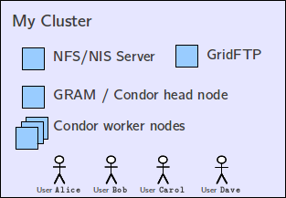
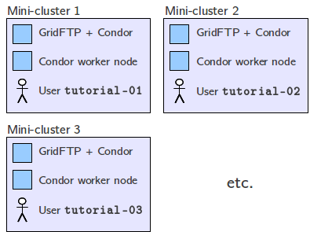

Globus Provision is a tool for deploying fully-configured `Globus <http://www.globus.org/>`_ 
systems on `Amazon EC2 <http://aws.amazon.com/ec2/>`_. For example,
you could use Globus Provision to deploy a cluster on EC2 with various Globus services, and
a Condor pool, installed on it: 

 
Globus Provision would also take care of setting up a shared NFS filesystem and an NIS
authentication domain, and creating user accounts on the cluster. X.509 certificates for the
hosts and users are also created automatically. Globus Provision is designed to be easy to use,
so deploying the above cluster would basically involve writing the following file:
 
::
	
	[domain-mycluster]
	users: alice bob carol dave
	nfs-nis: yes
	gridftp: yes
	gram: yes
	lrm: condor
	cluster-nodes: 3

Next, you would just have to run a few simple commands to instruct Globus Provision to
deploy this cluster on EC2 (you will need an Amazon EC2 account for this; we provide
instructions on how to do this in the documentation). Once the cluster
is running, Globus Provision allows you to dynamically add and remove hosts (e.g., to
increase the size of the Condor pool) and to add/remove user accounts. You can also
shut down your cluster while not in use (to avoid paying Amazon EC2 for resources
that are just idling), and resume it at a later time.

A typical Globus Provision interaction would look something like this:

.. highlight:: bash

::

	$ gp-instance-create -c mycluster.conf
	Created new instance: gpi-02156188
	
	$ gp-instance-start gpi-02156188
	Starting instance gpi-02156188... done!
	Started instance in 2 minutes and 34 seconds
	
	$ gp-instance-describe gpi-02156188
	gpi-02156188: Running
	
	Domain 'mycluster'
	    mycluster-server      Running  ec2-X-X-X-X.compute-1.amazonaws.com  10.X.X.X
	    mycluster-gridftp     Running  ec2-X-X-X-X.compute-1.amazonaws.com  10.X.X.X
	    mycluster-condor      Running  ec2-X-X-X-X.compute-1.amazonaws.com  10.X.X.X 
	    mycluster-condor-wn1  Running  ec2-X-X-X-X.compute-1.amazonaws.com  10.X.X.X	
	    mycluster-condor-wn2  Running  ec2-X-X-X-X.compute-1.amazonaws.com  10.X.X.X  
	    mycluster-condor-wn3  Running  ec2-X-X-X-X.compute-1.amazonaws.com  10.X.X.X
	   
	$ gp-instance-add-host   --domain  mycluster \
	                             --id  mycluster-condor-wn4 \
	                        --depends  mycluster-condor \
	                       --run-list  role[domain-nfsnis-client],role[domain-clusternode-condor] \
	                       gpi-02156188
	              
	Adding new host to gpi-02156188...done!
	Added host in 1 minutes and 17 seconds
	
	$ gp-instance-terminate gpi-02156188
	Terminating instance gpi-02156188... done!

Globus Provision also includes experimental support for the `Globus Online <https://www.globusonline.org/>`_
Transfer service. If your deployment includes a GridFTP server, Globus Provision
can register that GridFTP server as a Globus Online transfer endpoint for you.
So, if you have data you need to run some computation on, but do not have the
resources for running this computation, the combination of
Globus Provision and Globus Online Transfer allows you to do the following:

#. Deploy a cluster like the one shown above using Globus Provision.
#. Turn it into a Globus Online transfer endpoint.
#. Transfer your data into the cluster from an existing Globus Online endpoint, or from your
   own computer using `Globus Connect <https://www.globusonline.org/globus_connect/>`_.
#. Perform a computation on your data, or give access to some of your users
   (``alice``, ``bob``, etc.) so they can experiment with the data on your cluster.
#. Transfer the results from the computation out of the cluster.
#. Shut down the cluster.

Finally, Globus Provision also offers a lower-level interface that allows you to specify more
complex deployments (i.e., those that cannot be expressed using the simple configuration file
format show above). For example, you could use this interface to generate deployments where
you have not one but multiple clusters, each with its own set of users. This is a common
scenario when you need to teach a workshop, and want to give each student their own
"personal cluster":

